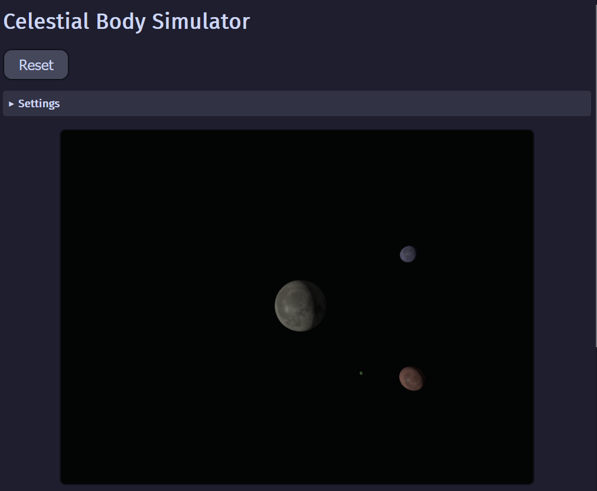

# Celestial System Simulator

This is the source code for [celestialsimulator.kagof.com](https://celestialsimulator.kagof.com/), a 3D celestial orbit simulator for the browser, written using Three.js.



## Building & Running

To run it locally, simply run:
```sh
npm i
npm run dev
```

and open `localhost:4000` in your browser.

to build a production bundle, run:
```sh
npm run build
```

to run a production preview, run:
```sh
npm run preview
```

and to clean up the files created, run:
```sh
npm run clean
```

## Technical details

The simulation is created in a basic static HTML webpage. The simulation is written in [Three.js](https://github.com/mrdoob/three.js/). Textures & normal maps were taken from [NASA's Scientific Visualization Studio](https://svs.gsfc.nasa.gov/4720). Colors for the webpage are based on the [Catppuccin Mocha](https://github.com/catppuccin/palette/blob/main/docs/css.md) palette. [Vite](https://vite.dev/) is used for bundling & as a local dev server.

## Simulation

The simulator calculations changes in acceleration using [the general equation for Newtonian gravity](https://en.wikipedia.org/wiki/N-body_problem):

<math display="block">
    <mrow>
        <msub>
            <mi>m</mi>
            <mi>i</mi>
        </msub>
        <mfrac>
            <mrow>
                <msup>
                    <mi>d</mi>
                    <mn>2</mn>
                </msup>
                <msub>
                    <mi><b>q</b></mi>
                    <mi>i</mi>
                </msub>
            </mrow>
            <mrow>
                <mi>d</mi>
                <msup>
                    <mi>t</mi>
                    <mn>2</mn>
                </msup>
            </mrow>
        </mfrac>
        <mo>=</mo>
        <munderover>
            <mo>&sum;</mo>
            <mrow>
                <mi>j</mi>
                <mo>=</mo>
                <mn>0</mn>
                <mo>,</mo>
                <mi>j</mi>
                <mo>&ne;</mo>
                <mi>i</mi>
            </mrow>
            <mrow>
                <mi>n</mi>
                <mo>-</mo>
                <mn>1</mn>
            </mrow>
        </munderover>
        <mfrac>
            <mrow>
                <mn>G</mn>
                <msub>
                    <mi>m</mi>
                    <mi>i</mi>
                </msub>
                <msub>
                    <mi>m</mi>
                    <mi>j</mi>
                </msub>
                <mo>(</mo>
                <msub>
                    <mi><b>q</b></mi>
                    <mi>j</mi>
                </msub>
                <mo>-</mo>
                <msub>
                    <mi><b>q</b></mi>
                    <mi>i</mi>
                </msub>
                <mo>)</mo>
            </mrow>
            <mrow>
                <mo>||</mo>
                <msub>
                    <mi><b>q</b></mi>
                    <mi>j</mi>
                </msub>
                <mo>-</mo>
                <msub>
                    <mi><b>q</b></mi>
                    <mi>i</mi>
                </msub>
                <msup>
                    <mo>||</mo>
                    <mn>3</mn>
                </msup>
            </mrow>
        </mfrac>
    </mrow>
</math>

where 

* <math><msub><mi>m</mi><mi>k</mi></msub></math> is the mass of body <math><mi>k</mi></math>
* <math><msub><mi><b>q</b></mi><mi>k</mi></msub></math> is the position of body  <math><mi>k</mi></math>
* <math><mn>G</mn></math> is the gravitational constant
* <math><mo>||</mo><msub><mi><b>q</b></mi><mi>l</mi></msub><mo>-</mo><msub><mi><b>q</b></mi><mi>k</mi></msub><mo>||</mo></math> is the magnitude of the Euclidean distance between bodies <math><mi>k</mi></math> and <math><mi>l</mi></math>

## Features

The simulator currently features:

* Newtonian gravity between n objects
* Live adjustable gravitational constant G
* Lighting with shadows & normals
* Adjustable body size, density, rotation, shininess, initial velocity & position (though not exposed to the end user yet) 

## Features to build

I intend to add:

* elastic collisions between bodies
* fading trails behind bodies
* camera controls/following
* customizable number of bodies
* customization of bodies' starting properties (size, color, density, rotation, initial velocity & position)
* randomizer
* import/export setup to/from JSON